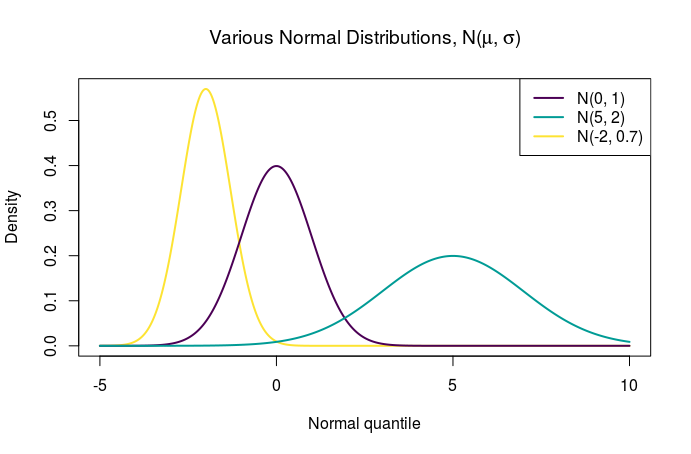
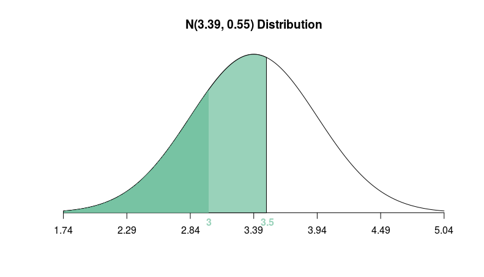

```{r setup, include=FALSE}
knitr::opts_chunk$set(echo = TRUE)
if (!("checkmate" %in% installed.packages()))
  install.packages('checkmate')
source("plot_norm.R")
# source("shuffle_two_groups.R")
```

# Learning Objectives

## Statistical Learning Objectives
**DO THIS**

## R Learning Objectives
**DO THIS**

## Functions covered in this lab
**DO THIS**

# Weekly Advice
You'll probably find it useful to revisit lab 5 to help with this week's report!


<hr />

**MAKE SURE YOU RUN THE `setup` CHUNK ON LINE 14**

# Lab Tutorial

This week, we're going to talk about the *normal distribution*. A "distribution" refers to the possible values a random variable can take as well as the probability that it takes those values. It is commonly used to approximate all sorts of things in nature and life.

Let's take a look at the normal distribution.



It takes two numbers to describe a normal distribution: the **mean** and **standard deviation**. The way we describe a normal distribution is N(mu, sigma), where mu is the population mean and sigma is the population standard deviation. Normal distributions are all bell-shaped, unimodal, and symmetric, regardless of the mean ($\mu$) and standard deviation ($\sigma$). The mean $\mu$ specifies the *center* of the distribution. The standard deviation $\sigma$ specifies the *variability* of the distribution (meaning, how narrow or wide is it?).

## Probability with Normal Distributions

The birth weight of newborn babies in Wales is normally-distributed with a mean of 3.39 kg (7.47 lbs)and a standard deviation of 0.55kg (1.21lbs).^[https://www.healthknowledge.org.uk/public-health-textbook/research-methods/1b-statistical-methods/statistical-distributions]

If something has a normal distribution, the probability of that thing taking on a particular range of values is the area under the normal curve between those values. Let's find the probability that a baby in Wales will weigh less than 3 kg (6.61 lbs).

To draw the area that corresponds to this probability, use a function we wrote called `plot_norm()`. 

```{r plot1}
plot_norm(mean = 3.39, sd = 0.55, shadeValues = 3, direction = "less")
```

To make this diagram, we're using a function we built for you called `plotNorm()`. You pass `plotNorm()` the following arguments:

- `mean`: the mean of the normal distribution you'd like to draw ($\mu$)
- `sd`: the standard deviation of the normal distribution you'd like to draw ($\sigma$)
- `shadeValues` (optional): either a number or a vector of two numbers (using `c()`) that are the boundaries of the region you'd like to shade.
- `direction`: where to shade (`"less"`, `"greater"`, `"inside"`, or `"outside"`)
- `col.shade`: the color to use when shading
- any other graphical parameters you want to use to control the appearance of the plot (like `main`, etc.)

To find the area of the blue shaded region, we'll use the `pnorm()` function (`p` stands for `p`robability):

```{r pnormExample1}
pnorm(q = 3, mean = 3.39, sd = 0.55)
```

We expect that about 23.9% of Welsh babies will weigh less than 3 kg at birth.

We can also find the probability of a Welsh baby having a birth weight of 3.5 kg or greater. First, we'll draw the plot. Notice that we're setting `direction = "greater"` now.

```{r plot2}
plot_norm(mean = 3.39, sd = 0.55, shadeValues = 3.5, 
          direction = "greater", 
          col.shade = "peachpuff")
```

There are two ways we can deal with the fact that we're now shading "up" (to the right):

1. Use the fact that the total area under the normal curve is 1
2. Use the `lower.tail` argument to `pnorm()` and set it to `FALSE`.

```{r pnormExampleUp}
1 - pnorm(3.5, mean = 3.39, sd = 0.55)
pnorm(3.5, mean = 3.39, sd = 0.55, lower.tail = FALSE)
```

Now, let's find the probability that a baby born in Wales weighs between 3 and 3.5 kg. Start by drawing the figure:

```{r plot3}
plot_norm(mean = 3.39, sd = 0.55, 
          shadeValues = c(3, 3.5), 
          direction = "between", 
          col.shade = "forestgreen")
```

Here, we need to find the probability by using `pnorm()` twice -- first to find the area to the left of 3.5, then again to find the area to the left of 3.0 -- and subtracting.



```{r pnormSubtract}
pnorm(q = 3.5, mean = 3.39, sd = 0.55) - pnorm(q = 3, mean = 3.39, sd = 0.55)
```


## Normal Quantiles

Quantiles are cut points of a distribution that divides the distribution into equal areas. For example, the median divides a distribution into 2 equal AREAS, and quartiles divide a distribution into 4 equal AREAS.

The `q` argument in `pnorm()` stands for `q`uantile. `pnorm()` gives us the area to the left (if `lower.tail = TRUE`) of `q`. Given a number `p` between 0 and 1, we can use `qnorm()` to find the quantile `q` that will have `p` area to the left or right of that number. We say that `q` is the "`p`th quantile of the N($\mu$, $\sigma$) distribution".

We saw above that the area to the left of 3.0 in a N(3.39, 0.55) distribution is 0.239. Let's use this to demonstrate the use of `qnorm()`:

```{r, qnormLeft}
qnorm(p = 0.239, mean = 3.39, sd = 0.55)
```

So we can see that `qnorm()` is the opposite of `pnorm`, in the way that division is the opposite of multiplication: one undoes the other. 

We can also use `lower.tail = FALSE` inside `qnorm()` to find the (1-`p`)th quantile (the number such that there is 1-`p` area to the left and `p` area to the right):

```{r, qnormRight}
qnorm(p = 0.421, mean = 3.39, sd = 0.55, lower.tail = FALSE)
```

**NOTE**: you can't use `1-qnorm(p)` instead of setting `lower.tail = FALSE` since the normal distribution extends to all real numbers (negative infinity to positive infinity). 